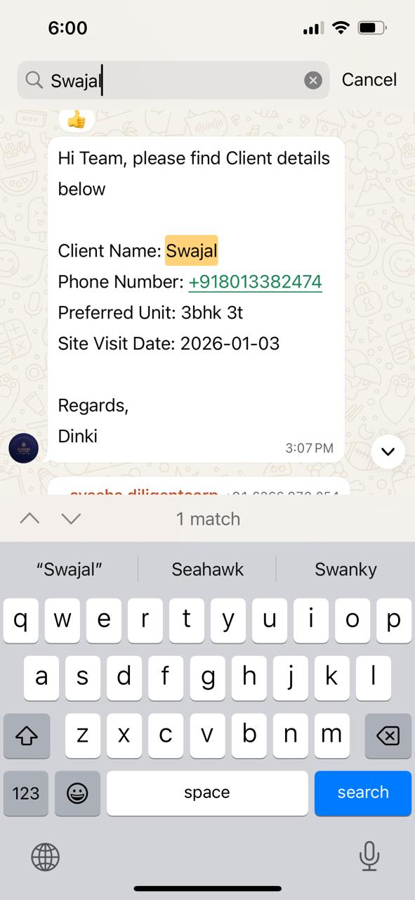
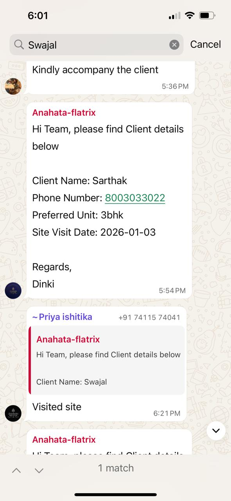
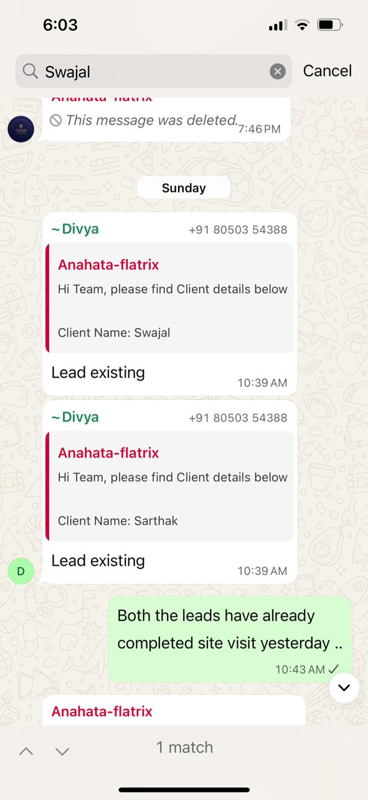
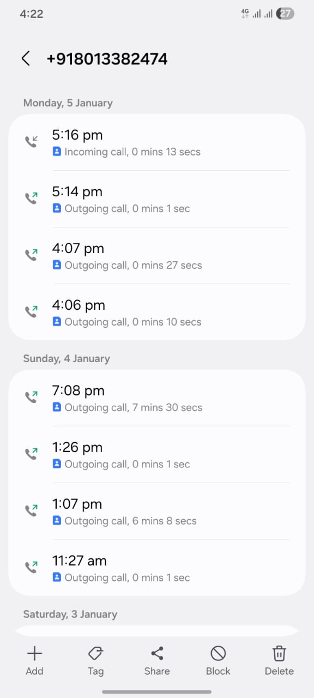
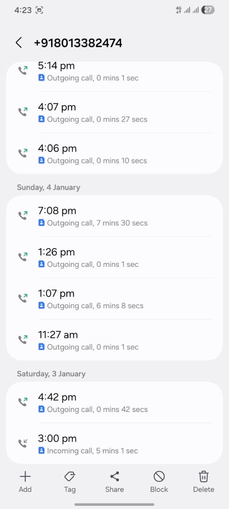
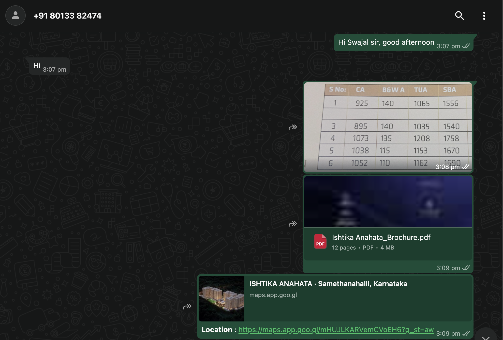
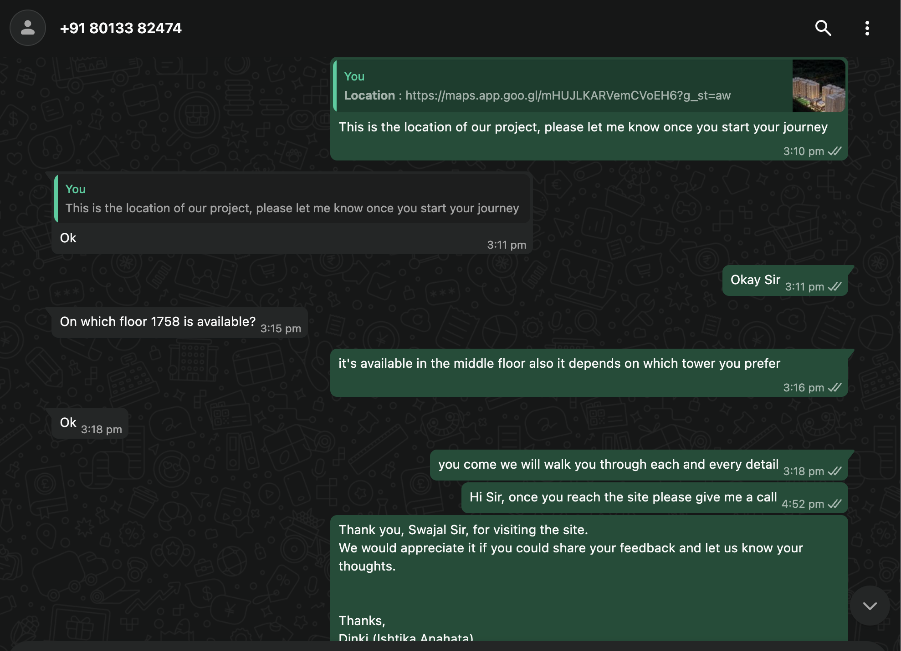
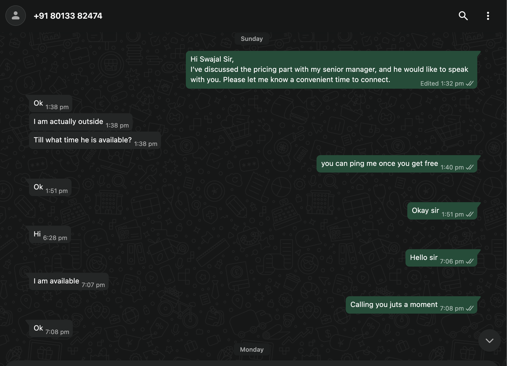
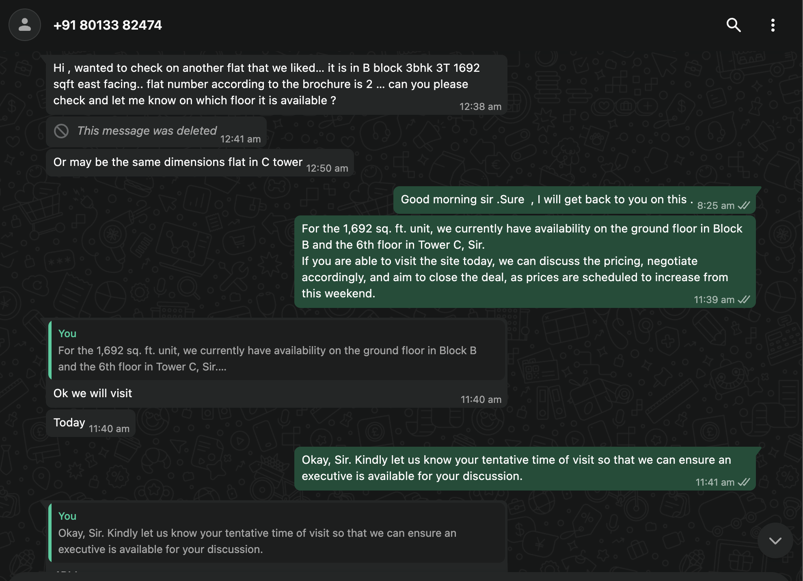
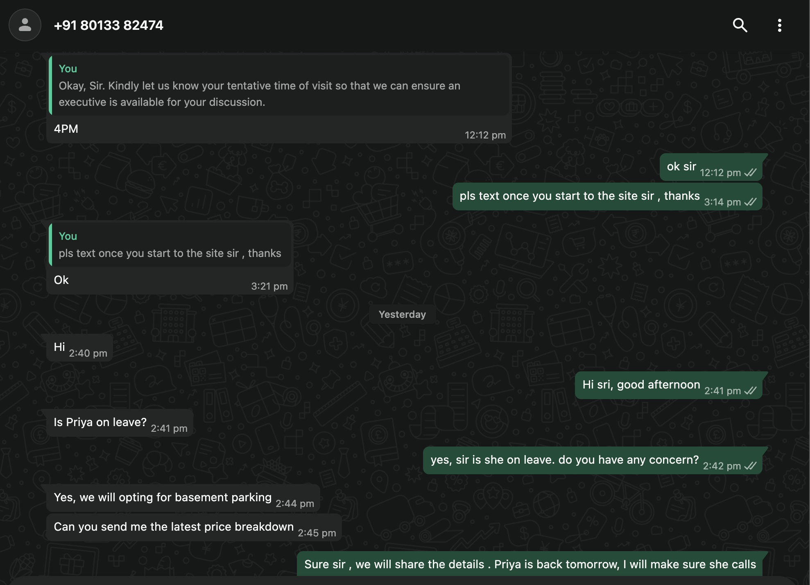

# LEAD REGISTRATION DISPUTE - COMPLETE DOCUMENTATION

## Channel Partner Escalation Case

---

## EXECUTIVE SUMMARY

This document presents comprehensive evidence regarding a lead registration dispute where:
- **Lead registered on: 3rd January 2026**
- **Customer site visit confirmed: 3rd January 2026 (same day)**
- **"Existing lead" notification received: 4th January 2026 (next day)**
- **Final outcome: Customer successfully booked the flat**

Despite registering the lead first and receiving visit confirmation from the builder's team, we are now facing commission denial due to "existing lead" status.

---

## TIMELINE OF EVENTS

### 1. Lead Registration - 3rd January 2026

**Action:** Lead registered in builder's system
**Status:** Successfully registered
**Evidence:** Screenshot below

**Key Point:** This establishes our priority claim - we registered this lead FIRST.

---

### 2. Customer Site Visit Confirmation - 3rd January 2026 (Same Day)

**Action:** Customer visited site on the same day as registration
**Status:** Visit confirmed by builder's diligent team
**Evidence:** Screenshot below

**Key Point:** Builder's own team confirmed the customer visit on 3rd January, establishing legitimacy of our lead.

---

### 3. "Lead Existing" Message - 4th January 2026 (Next Day)

**Action:** Received notification that lead already exists
**Status:** We immediately responded that customer had ALREADY VISITED on 3rd January
**Evidence:** Screenshot below

**Key Point:** This message came AFTER our registration and AFTER the confirmed visit. Our response clearly stated the customer had already visited.

---

### 4. Customer Follow-up & Engagement

**Action:** Continued customer engagement through calls and WhatsApp
**Status:** Maintained regular communication leading to successful booking

#### Call Log Evidence:

**Call Log Part 1:**

**Call Log Part 2:**

**Key Point:** These call logs demonstrate our continuous engagement and effort in closing this lead.

---

### 5. WhatsApp Communication with Customer

**Action:** Detailed follow-up conversations via WhatsApp
**Status:** Active engagement demonstrating our role in the conversion

#### WhatsApp Conversation Evidence:

**Communication Part 1:**

**Communication Part 2:**

**Communication Part 3:**

**Communication Part 4:**

**Communication Part 5:**

**Key Point:** Complete communication trail proving our involvement from start to finish.

---

## CRITICAL FACTS

1. **Lead registered by us on 3rd January 2026**
2. **Customer visit CONFIRMED by builder's team on 3rd January 2026**
3. **"Existing lead" message received on 4th January 2026 - AFTER our registration and confirmed visit**
4. **We immediately clarified that customer had already visited**
5. **We continued follow-ups and successfully closed the deal**
6. **Customer has booked the flat as a result of our efforts**

---

## OUR POSITION

The timeline and evidence clearly demonstrate:

- **Priority:** We registered the lead before any "existing" notification
- **Legitimacy:** Builder's own team confirmed the customer visit
- **Effort:** We invested significant time in calls and follow-ups
- **Result:** Customer booking is a direct outcome of our work

The "existing lead" notification came AFTER our registration and AFTER your team's visit confirmation. This cannot be grounds for commission denial.

---

## REQUEST FOR ACTION

We formally request:

1. **Immediate review** of this case based on provided evidence
2. **Commission credit** as per our channel partner agreement
3. **Written confirmation** of resolution
4. **Process clarification** to prevent such issues in future

---

## CONCLUSION

This documentation establishes beyond doubt that:
- We acted in good faith
- We registered the lead first
- We received confirmation from your team
- We closed the deal successfully

We value our partnership with the builder and trust this matter will be resolved fairly based on facts and timeline evidence.

---

**Prepared by:** Channel Partner Team
**Date:** 12th January 2026
**Case Type:** Lead Registration Dispute - Commission Credit

---

## APPENDIX - DOCUMENT INDEX

1. Lead Registration Screenshot
2. Customer Visit Confirmation Screenshot
3. Lead Existing Message Screenshot
4. Customer Call Logs (2 screenshots)
5. WhatsApp Communication Trail (5 screenshots)

**Total Evidence Files:** 10 supporting documents

---

*All timestamps and communications are authentic and can be verified. We are prepared to provide additional documentation if required.*